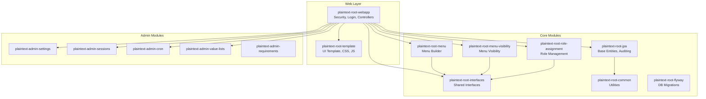

# Plaintext Root

[](https://github.com/Plaintext-Gmbh/plaintext-root/actions/workflows/build-deploy.yaml)
[](https://opensource.org/licenses/MPL-2.0)
[](https://openjdk.org/)
[](https://spring.io/projects/spring-boot)
[](https://www.primefaces.org/)
[](#code-coverage)

**Plaintext Root** is an open-source application framework for rapidly building multi-tenant web applications with Jakarta Faces (JSF), PrimeFaces, and Spring Boot. It provides a complete foundation including security, navigation, admin panels, user management, and a pluggable template system — so you can focus on your business logic.

## Key Features

- **Multi-Tenancy** — Built-in mandate system for data isolation between tenants
- **Security** — Spring Security with role-based access control (User/Admin/Root), CSRF protection, session tracking
- **Two-Factor Auth (TOTP)** — Optional, opt-in authenticator-app 2FA for local password users with recovery codes ([docs](docs/security/TOTP_2FA.md); default **off** via `plaintext.security.totp.enabled`)
- **Page Access Guard** — Per-view authorization derived from menu visibility (roles + mandate), enforced in a servlet filter before the FacesServlet, with an allowlist/alias mechanism and a build-time invariant test ([docs](docs/security/PAGE_ACCESS_GUARD.md); `plaintext.security.page-guard.mode`)
- **Menu System** — Annotation-driven menu builder with role-based visibility and badge support
- **Admin Panels** — Pre-built admin modules for settings, sessions, cron jobs, emails, and more
- **Template System** — Swappable UI templates (open-source Plaintext template included)
- **Email** — Complete email send/receive system with IMAP and SMTP support
- **API Tokens** — Token-based REST API authentication
- **Cron Jobs** — Annotation-driven scheduled task system with monitoring UI
- **User Preferences** — Persistent theme, layout, and UI preferences per user

## Architecture



## Module Overview

| Module | Description |
|--------|-------------|
| `plaintext-root-interfaces` | Shared interfaces for security, settings, menu visibility |
| `plaintext-root-common` | Common utilities, XStream serialization, object storage |
| `plaintext-root-jpa` | Base JPA entities with audit fields, generic repositories |
| `plaintext-root-menu` | Annotation-driven menu system with hierarchical support |
| `plaintext-root-menu-visibility` | Mandate-based menu visibility control |
| `plaintext-root-role-assignment` | User role assignment and management |
| `plaintext-root-flyway` | Database migration management |
| `plaintext-root-webapp` | Main web application with security, login, and controllers |
| `plaintext-root-template` | UI Template |
| `plaintext-admin-settings` | Application settings management UI |
| `plaintext-admin-sessions` | Active session monitoring and insights |
| `plaintext-admin-cron` | Cron job monitoring and management UI |
| `plaintext-admin-apitoken` | API-token management for REST endpoints |
| `plaintext-admin-i18n` | Translatable resource bundles and UI |
| `plaintext-admin-oidc` | OIDC/OAuth2 provider configuration |
| `plaintext-admin-mailtemplate` | Editable mail templates |
| `plaintext-admin-modules` | Module registry and activation |
| `plaintext-admin-notifications` | In-app and push notifications |
| `plaintext-admin-secrets` | Secret store with pluggable backends |
| `plaintext-admin-webhooks` | Outgoing webhook configuration |
| `plaintext-admin-requirements` | Requirements management with AI integration |
| `plaintext-root-archtests` | Shared ArchUnit architecture/lint tests |

The authoritative list is the `<modules>` section of the root `pom.xml`.

## Tech Stack

| Technology | Version | Purpose |
|-----------|---------|---------|
| Java | 25 | Language |
| Spring Boot | 4.x | Application framework |
| Jakarta Faces | 4.1 | UI component framework |
| PrimeFaces | 15.x | JSF component library |
| JoinFaces | 5.x | Spring Boot + JSF integration |
| PostgreSQL | 18+ | Database |
| Flyway | — | Database migrations |
| Lombok | latest | Boilerplate reduction |

> Exact versions live in the parent `pom.xml`; the table above lists major
> lines so this README does not need to be touched on every dependency bump.

## Quick Start

### Prerequisites

- **Java 25+** (e.g., via [SDKMAN](https://sdkman.io/): `sdk install java 25-open`)
- **Maven 3.9+**
- **Docker** or **Podman** (optional, only for PostgreSQL)

### 1. Clone and Build

```bash
git clone https://github.com/Plaintext-Gmbh/plaintext-root.git
cd plaintext-root

# Build all modules (no database needed!)
mvn clean install -DskipTests
```

### 2. Run the Application

```bash
mvn spring-boot:run -pl plaintext-root-webapp
```

The application starts at **http://localhost:8080** with an **in-memory H2 database** (PostgreSQL compatibility mode). No external database setup needed!

> **Note:** Data is lost on restart with H2. For persistent storage, switch to PostgreSQL (see below).

### 3. Switch to PostgreSQL (Optional)

For production or persistent data, switch to PostgreSQL:

```bash
# Start PostgreSQL
docker compose up -d

# Run with PostgreSQL profile
mvn spring-boot:run -pl plaintext-root-webapp -Dspring-boot.run.profiles=postgres
```

Or set the environment variable:
```bash
SPRING_PROFILES_ACTIVE=postgres mvn spring-boot:run -pl plaintext-root-webapp
```

### 4. H2 Console

In dev mode, the H2 database console is available at **http://localhost:8080/h2-console** with:
- JDBC URL: `jdbc:h2:mem:plaintext_root`
- Username: `sa`
- Password: *(empty)*

## Multi-Tenancy

Plaintext Root has built-in multi-tenancy support through the **mandate** system:

- Each user is assigned to a mandate (tenant)
- Data is isolated per mandate at the application level
- Menu visibility can be controlled per mandate
- Root users can switch between mandates at runtime
- The `SuperModel` base entity automatically tags records with the current mandate

## Menu System

Menus are defined as Spring beans using the `MenuItemImpl` class:

```java
@Component
public class MyMenu extends MenuItemImpl {
    public MyMenu() {
        setTitle("My Feature");
        setParent("Admin");           // Parent menu item
        setCommand("myfeature.xhtml"); // Target page
        setIcon("pi pi-star");         // PrimeIcons icon
        setOrder(100);                 // Sort order
        setRoles(List.of("ROLE_ADMIN")); // Required roles
    }
}
```

Menus are automatically discovered, sorted, and rendered with role-based visibility.

## Global Search (Cmd+K)

A topbar search field (`⌘K` / `Ctrl+K`) queries every module through the `SearchProvider` interface and
aggregates the results grouped by module. It mirrors the menu/dashboard registry pattern exactly: **root
defines the interface, each module registers a `@Component`, root collects all beans automatically and
queries them.** Each hit carries its own deep-link, so a click lands directly on the module's detail page —
root never needs to know about the target pages.

### How a module docks in

A module contributes hits by providing a single `@Component` that implements `SearchProvider`
(`ch.plaintext.boot.search.SearchProvider`, in `plaintext-root-interfaces`). No root change needed.

```java
@Component
@RequiredArgsConstructor
public class KorrespondenzSearchProvider implements SearchProvider {
    private final KorrespondenzRepository repo;
    private final PlaintextSecurity security;

    public String providerId()  { return "korrespondenz"; }
    public String moduleTitle() { return "Korrespondenz"; } // must match the module's menu title

    public List<SearchHit> search(String q, int limit) {
        return repo.searchByMandat(security.getMandat(), q, limit).stream()
            .map(k -> new SearchHitDTO(
                k.getTitel(),                        // title
                k.getDatum().toString(),             // subtitle
                "korrespondenz.html?id=" + k.getId(),// deep-link (like a MenuAnnotation.link)
                "pi pi-envelope",                    // icon
                k.relevance(q)))                     // score (ranking within the group)
            .collect(Collectors.toList());
    }
}
```

Key points:

- **`getLink()` is the deep-link.** It is exactly a `MenuAnnotation.link` (relative to the context path,
  e.g. `korrespondenz.html?id=42`). The frontend navigates to `contextPath + "/" + link`.
- **Visibility is coupled to the menu.** `SearchService` only queries a provider when its `moduleTitle()`
  matches a *visible* menu title (`MenuRegistry.getAllMenuItems()` → `isOn()`), so hits never leak from
  modules the user/tenant cannot see. Each provider additionally scopes its own hits to the active tenant
  via `PlaintextSecurity.getMandat()`.
- **Cross-cutting root providers** (e.g. menu/page search, user search) are not tied to a single menu;
  they return `isMenuScoped() == false` and enforce visibility/roles themselves.
- **Robust & timeboxed.** A failing provider is caught and yields an empty list; queries under 2 chars are
  ignored and query length is capped. Results are grouped by module and capped per module.

### REST endpoint

`GET /api/search?q=...` (authenticated; runs behind the normal app auth — no security-config change)
returns JSON:

```json
{ "groups": [ { "module": "Korrespondenz",
                "hits": [ { "title": "...", "subtitle": "...", "link": "...", "icon": "..." } ] } ] }
```

The topbar frontend debounces (~200 ms), supports ↑/↓/Enter/Esc, and navigates to the hit's deep-link on
click. Root ships two providers out of the box: **page/navigation search** (jump to any visible menu page)
and **user search** (ROOT/ADMIN only → `useradmin.xhtml`). Consumer-app modules add their own providers in
follow-up work.

## Template System

The UI template is a separate Maven module that can be swapped:

```xml
<!-- Open-source template (default) -->
<dependency>
    <groupId>ch.plaintext</groupId>
    <artifactId>plaintext-root-template</artifactId>
</dependency>
```

The template provides: layout CSS (light/dark), navigation JavaScript, XHTML templates (topbar, sidebar, config panel, footer), and theme color overrides.

### Features

- **Light/Dark mode** with persistent preference
- **Three menu layouts**: Sidebar, Horizontal, Slim
- **Color themes**: Blue, Green, Orange, Turquoise, Avocado, Purple, Red, Yellow
- **Input styles**: Outlined or Filled
- **Responsive** design with mobile sidebar

## Database Migrations

Flyway migrations use H2 (PostgreSQL mode) compatible SQL syntax and are located in each module's `src/main/resources/db/migration/` directory. Migration file names follow the pattern:

```
V{timestamp}__description.sql
```

The timestamp is simply the number of seconds since 2000-01-01, which keeps new
migrations strictly increasing and collision-free across modules:

```bash
echo $(( $(date +%s) - 946684800 ))
```

See [docs/FLYWAY_MIGRATIONS.md](docs/FLYWAY_MIGRATIONS.md) for the conventions.

## Security Roles

| Role | Description |
|------|-------------|
| `ROLE_USER` | Standard user access |
| `ROLE_ADMIN` | User management, admin panels |
| `ROLE_ROOT` | Full access, mandate switching |

## Project Structure

```
plaintext-root/
├── plaintext-root-interfaces/          # Shared interfaces
├── plaintext-root-common/              # Utilities
├── plaintext-root-jpa/                 # Base JPA entities
├── plaintext-root-menu/                # Menu builder
├── plaintext-root-menu-visibility/      # Menu visibility
├── plaintext-root-role-assignment/     # Role management
├── plaintext-root-flyway/              # DB migrations
├── plaintext-root-template/            # UI template
├── plaintext-root-webapp/              # Main web application
├── plaintext-admin-settings/           # Settings admin
├── plaintext-admin-sessions/           # Session monitoring
├── plaintext-admin-cron/               # Cron job admin
├── plaintext-admin-apitoken/           # API tokens
├── plaintext-admin-i18n/               # Translations
├── plaintext-admin-oidc/               # OIDC configuration
├── plaintext-admin-mailtemplate/       # Mail templates
├── plaintext-admin-modules/            # Module registry
├── plaintext-admin-notifications/      # Notifications
├── plaintext-admin-secrets/            # Secret store
├── plaintext-admin-webhooks/           # Webhooks
├── plaintext-admin-requirements/       # Requirements + AI
├── plaintext-root-archtests/           # ArchUnit architecture tests
├── docs/                               # Documentation
├── quality/                            # Quality-gate configuration
├── scripts/                            # Analysis helper scripts
├── compose.yaml                        # PostgreSQL dev setup
├── Dockerfile                          # Production container
├── LICENSE                             # MPL 2.0
└── NOTICE                              # Third-party components
```

### Maintainer-only tooling

The executable `build` and `start` scripts in the repository root are the
maintainers' release/deploy TUI. They pull in shared shell libraries from
[`plaintext-scripts`](https://github.com/Plaintext-Gmbh/plaintext-scripts) and
assume a specific deployment environment. **They are not needed to build or run
the project** — use the plain Maven commands from the Quick Start instead.

## Contributing

See [CONTRIBUTING.md](CONTRIBUTING.md) for guidelines on how to contribute.

## Code Coverage

Coverage reports are generated with [JaCoCo](https://www.jacoco.org/) during `mvn test`. Reports are available in each module's `target/site/jacoco/` directory.

```bash
# Run tests with coverage
mvn clean test

# Open report (example for webapp module)
open plaintext-root-webapp/target/site/jacoco/index.html
```

Coverage reports are also uploaded as artifacts in the [CI pipeline](https://github.com/Plaintext-Gmbh/plaintext-root/actions).

## License

This project is licensed under the [Mozilla Public License 2.0](LICENSE).

Every Java source file carries the MPL 2.0 header. Third-party files that are
checked into this repository (PrimeFlex, PrimeIcons, marked.js — all MIT) and
the notable licenses among the Maven dependencies are listed in
[NOTICE](NOTICE).

## Security

Please report security issues as described in [SECURITY.md](SECURITY.md) —
not via public issues.
