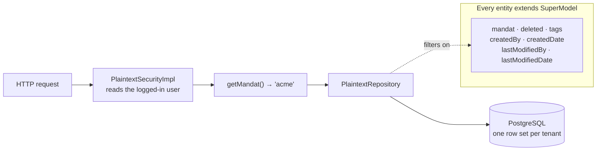
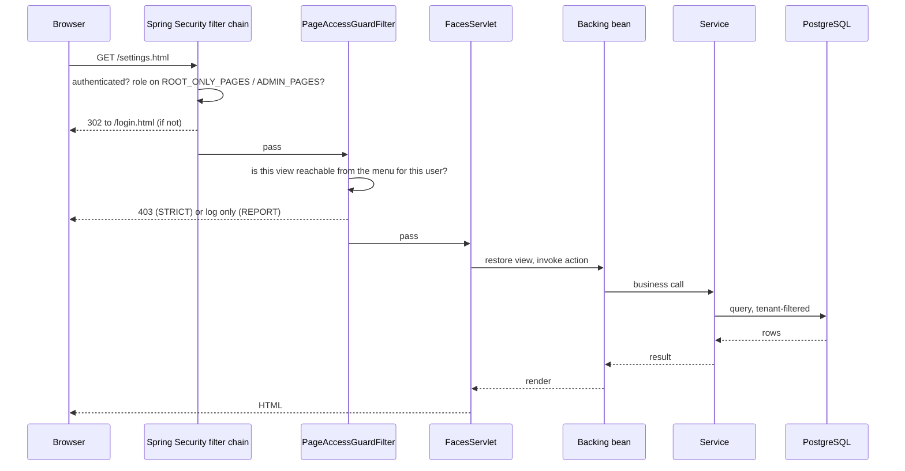
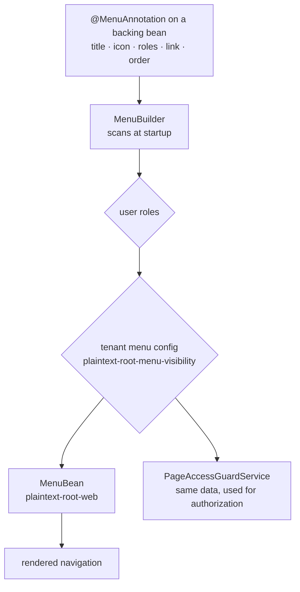
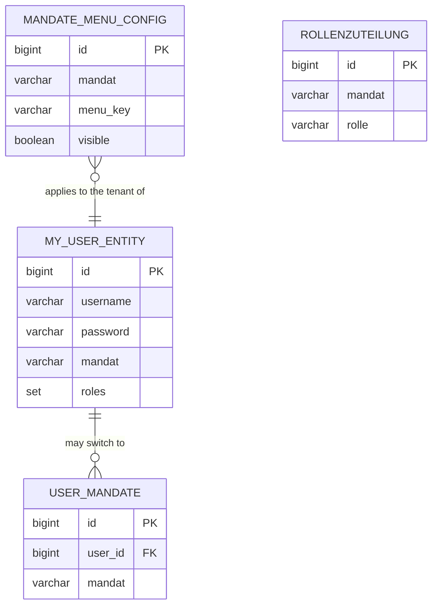
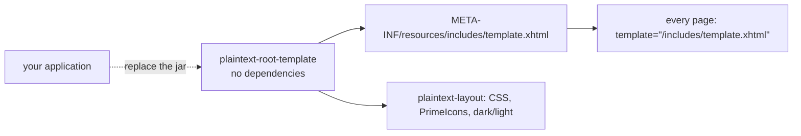
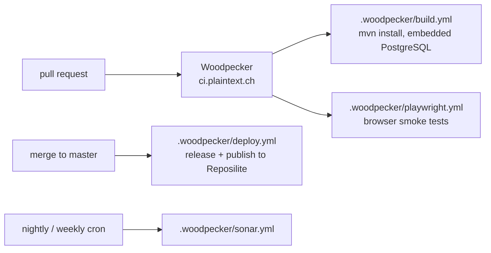

# Architecture

How Plaintext Root is put together, and why. Every diagram below was drawn from
the `pom.xml` files and the classes they name — if a diagram and the code
disagree, the code is right and this page is a bug.

> Last checked against release **1.652.0** (24 modules, Spring Boot 4.1.0,
> Jakarta Faces 4.1.15, PrimeFaces 15.0.15, Java 25).

## The idea in one paragraph

Plaintext Root is the part of a business application that is the same every
time: logging in, knowing who the user is, keeping one tenant's rows away from
the next, drawing a menu that only shows what the user may open, and the admin
screens that come with all of it. An application depends on
`plaintext-root-webapp`, adds its own modules, and inherits the rest. The
framework is a set of Maven modules, not a platform — there is no runtime to
install and no plugin registry.

## Modules

24 modules. The dependency graph in the [README](../README.md#architecture) is
the authoritative view; the short version is four layers:

| Layer | Modules | Depends on |
|-------|---------|-----------|
| **Contracts** | `plaintext-root-interfaces` | *nothing* |
| **Core** | `plaintext-root-menu`, `plaintext-root-common` | interfaces |
| **Infrastructure** | `plaintext-root-jpa`, `-flyway`, `-menu-visibility`, `-role-assignment`, `-pageguard`, `-web` | interfaces, common, menu |
| **Shell** | `plaintext-root-webapp`, `plaintext-root-template` | the 20 modules above plus 11 admin modules |

Two rules keep this from turning into a ball of mud:

1. **`plaintext-root-interfaces` never depends on anything.** A module that
   implements `PlaintextCron`, `SearchProvider`, `DeepLinkTarget` or
   `IUploadTarget` pulls in one small jar, not the framework. This is what lets
   an application module register with the framework without the framework
   knowing the module exists.
2. **Admin modules are leaves.** All twelve depend only on interfaces, common
   and menu, and nothing depends on them. That is what makes them removable with
   a Maven `<exclusion>` — see [Optional modules](OPTIONAL_MODULES.md).

`plaintext-root-archtests` is the odd one out: it ships ArchUnit rules in
`src/main` so that consuming applications can run the framework's own
architecture rules against their code with `dependenciesToScan`.

## Multi-tenancy

One database, one schema, one row set — separated by a discriminator column.

`SuperModel` lives in `plaintext-root-common`
(`ch.plaintext.framework.SuperModel`, `@MappedSuperclass`). It carries the
tenant column `mandat`, a soft-delete flag, the auditing fields and a tag list.
Repositories extend `PlaintextRepository`, whose finder methods take the tenant
into account; `PlaintextSecurityImpl.getMandat()` is the single source for
"which tenant is this request".

The trade-off is written down in
[ADR 0002](adr/0002-mandate-per-row-multitenancy.md): a discriminator column is
cheap to operate and easy to get wrong in a query, which is why the finders live
in a shared base class instead of in each repository.

## Request flow

Two gates, not one, and they answer different questions:

- **Spring Security** (`PlaintextSecurityConfig`) answers *may this user be on
  this URL at all* — including two hard-wired lists, `ROOT_ONLY_PAGES` and
  `ADMIN_PAGES`.
- **The page guard** (`plaintext-root-pageguard`) answers *is this view
  reachable from the menu this user sees*. It exists because the menu already
  encodes the answer, and repeating it in URL patterns is how the two drift
  apart.

A new admin page therefore needs **both**: a menu entry *and*, if it is not
covered by the patterns, an entry in the security config. Forgetting the second
is the usual cause of a 403 on a page that shows up in the menu. The guard
defaults to `REPORT` (log, don't block) so that adding it to an existing
application does not lock anyone out — see
[ADR 0004](adr/0004-page-guard-strict-als-default.md) and
[Page Access Guard](security/PAGE_ACCESS_GUARD.md).

## Menu system

The menu is declared where the page is implemented — an annotation on the
backing bean, not a central XML file. That single declaration drives three
things: what the user sees, what a tenant may switch off
(`MandateMenuConfig`), and what the page guard allows.

**Links end in `.html`, never `.xhtml`.** The application rewrites `.html` to
the Facelets view; `MenuLinkInvariantTest` fails the build if a menu entry
points at `.xhtml` directly.

## Data model

The framework owns few tables — it owns the *shape* of them.

Every application entity adds its own tables and inherits the `SuperModel`
columns. Framework migrations live in `plaintext-root-flyway` and in
`plaintext-root-webapp`; they are PostgreSQL-only, and
`FlywayMigrationenTest` rejects H2/HSQLDB idioms — see
[Flyway migrations](FLYWAY_MIGRATIONS.md).

## Template system

The template module has **no dependencies at all**, which is the point: an
application that wants a different shell replaces one jar instead of forking the
webapp. The pages reference the template by resource path, so the swap needs no
code change.

## Build, test and CI

Three things about this repository specifically:

- **It is release-only.** plaintext-root has had no DEV or PROD deployment since
  12 August 2026; the pipeline builds, tests and publishes the artifacts that
  the consuming applications pin. There is no `verify-dev`/`verify-prod` here.
- **Tests use an embedded PostgreSQL** (`io.zonky.test:embedded-postgres`), not
  Testcontainers and not H2 — the CI step needs no Docker socket.
- **The CI engine is Woodpecker**, switched over on 30 August 2026. See
  [CI pipeline](CI.md), and [Setting up Woodpecker](ci/WOODPECKER_SETUP.md) if
  you need to wire up a new repository.

## Where to read on

- [Module reference](MODULE_REFERENCE.md) — what each module contains
- [Architecture decisions](adr/) — why it is built this way, with the
  alternatives that were rejected
- [Role registry](ROLE_REGISTRY.md) — how a module declares its roles
- [Deep links](DEEPLINKS.md) — opening one record straight from an e-mail
